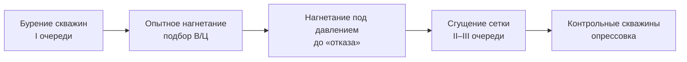

# NanoCem UT-9 · Инъекционная цементация для ремонта ГЭС
## Как это работает — процесс, схема и анимация

> **О файле.** Внутри — встроенные анимированные SVG-схемы (нагнетание, заливка трещины, проникновение). Анимация воспроизводится при рендере в HTML (GLM / браузер) и при открытии файлов из папки `svg/` напрямую в браузере. Слоты `` — под ваши реальные фото объекта.

---

## 1. Что такое инъекционная цементация

Это нагнетание под давлением жидкого цементного раствора в трещины, поры и пустоты сооружения и основания через пробуренные скважины. Раствор заполняет пути фильтрации и после твердения образует прочный водонепроницаемый монолит — восстанавливает противофильтрационную целостность плотины, основания и контактных зон.

Ключ к успеху — **проникающая способность раствора**. Обычный портландцемент (частицы 60–90 мкм) застревает на входе в тонкую трещину. Ультрадисперсный **NanoCem UT-9 (D95 ≤ 9 мкм)** проходит вглубь и заполняет щель до дна.

---

## 2. Общая схема

На схеме: раствор готовится на инъекционной станции, под давлением подаётся по шлангу в скважину через пакер и нагнетается в зону обработки, формируя цементационную завесу в основании.

<svg viewBox="0 0 720 410" xmlns="http://www.w3.org/2000/svg" role="img" aria-label="Схема инъекционной цементации плотины">
 <defs>
  <pattern id="rock" width="22" height="22" patternUnits="userSpaceOnUse">
    <path d="M0,22 L22,0" stroke="#cdd1c8" stroke-width="1"/>
  </pattern>
 </defs>
 <rect width="720" height="410" fill="#ffffff"/>
 <text x="20" y="28" font-family="'JetBrains Mono',monospace" font-size="12" letter-spacing="2" fill="#4F5C4C">СХЕМА · ИНЪЕКЦИОННАЯ ЦЕМЕНТАЦИЯ</text>
 <!-- foundation -->
 <rect x="0" y="250" width="720" height="160" fill="#eef0ec"/>
 <rect x="0" y="250" width="720" height="160" fill="url(#rock)"/>
 <line x1="0" y1="250" x2="720" y2="250" stroke="#b9bdb2" stroke-width="1.2"/>
 <!-- water -->
 <rect x="0" y="162" width="205" height="88" fill="#4E6E6B" opacity="0.14"/>
 <line x1="0" y1="162" x2="205" y2="162" stroke="#4E6E6B" stroke-width="1.2" opacity="0.6"/>
 <text x="40" y="200" font-family="'JetBrains Mono',monospace" font-size="11" fill="#4E6E6B">водохранилище</text>
 <!-- dam -->
 <path d="M205,150 L245,150 L335,250 L205,250 Z" fill="#dfe2dc" stroke="#b9bdb2" stroke-width="1.2"/>
 <text x="212" y="210" font-family="'JetBrains Mono',monospace" font-size="11" fill="#8A8F88">тело плотины</text>
 <!-- pump station -->
 <rect x="505" y="220" width="76" height="30" rx="2" fill="#33372f"/>
 <rect x="512" y="226" width="18" height="18" rx="1" fill="#6E7F6A"/>
 <text x="536" y="239" font-family="'JetBrains Mono',monospace" font-size="10" fill="#dfe2dc">PUMP</text>
 <text x="505" y="214" font-family="'JetBrains Mono',monospace" font-size="11" fill="#4F5C4C">инъекционная станция</text>
 <!-- hose -->
 <path d="M505,232 C455,232 425,238 400,250" fill="none" stroke="#8A8F88" stroke-width="3"/>
 <!-- borehole casing -->
 <line x1="396" y1="250" x2="396" y2="352" stroke="#b9bdb2" stroke-width="1.4"/>
 <line x1="404" y1="250" x2="404" y2="352" stroke="#b9bdb2" stroke-width="1.4"/>
 <rect x="394" y="298" width="12" height="15" fill="#4F5C4C"/>
 <text x="412" y="290" font-family="'JetBrains Mono',monospace" font-size="11" fill="#4F5C4C">скважина · пакер</text>
 <!-- pressure arrow -->
 <path d="M400,258 l0,26" stroke="#6E7F6A" stroke-width="2"/>
 <path d="M400,286 l-4,-7 l8,0 z" fill="#6E7F6A"/>
 <text x="410" y="272" font-family="'JetBrains Mono',monospace" font-size="11" fill="#6E7F6A">нагнетание под давлением</text>
 <!-- grout spread -->
 <ellipse cx="400" cy="340" rx="6" ry="4" fill="#6E7F6A" opacity="0.22">
   <animate attributeName="rx" values="6;64;64;6" keyTimes="0;0.7;0.9;1" dur="5s" repeatCount="indefinite"/>
   <animate attributeName="ry" values="4;30;30;4" keyTimes="0;0.7;0.9;1" dur="5s" repeatCount="indefinite"/>
 </ellipse>
 <g stroke="#6E7F6A" stroke-width="2" stroke-linecap="round">
   <line x1="400" y1="340" x2="356" y2="356"><animate attributeName="opacity" values="0;1;1;0" keyTimes="0;0.4;0.9;1" dur="5s" begin="0s" repeatCount="indefinite"/></line>
   <line x1="400" y1="340" x2="444" y2="356"><animate attributeName="opacity" values="0;1;1;0" keyTimes="0;0.4;0.9;1" dur="5s" begin="0.3s" repeatCount="indefinite"/></line>
   <line x1="400" y1="340" x2="368" y2="328"><animate attributeName="opacity" values="0;1;1;0" keyTimes="0;0.4;0.9;1" dur="5s" begin="0.6s" repeatCount="indefinite"/></line>
   <line x1="400" y1="340" x2="432" y2="328"><animate attributeName="opacity" values="0;1;1;0" keyTimes="0;0.4;0.9;1" dur="5s" begin="0.9s" repeatCount="indefinite"/></line>
   <line x1="400" y1="340" x2="400" y2="362"><animate attributeName="opacity" values="0;1;1;0" keyTimes="0;0.4;0.9;1" dur="5s" begin="1.2s" repeatCount="indefinite"/></line>
 </g>
 <text x="430" y="346" font-family="'JetBrains Mono',monospace" font-size="11" fill="#4F5C4C">цементационная завеса</text>
 <text x="540" y="395" font-family="'JetBrains Mono',monospace" font-size="11" fill="#8A8F88">скальное основание</text>
 <!-- grout pulses -->
 <circle r="4.2" fill="#6E7F6A"><animateMotion dur="2.4s" repeatCount="indefinite" path="M505,232 C455,232 425,238 400,250 L400,338"/></circle>
 <circle r="4.2" fill="#6E7F6A"><animateMotion dur="2.4s" begin="-0.8s" repeatCount="indefinite" path="M505,232 C455,232 425,238 400,250 L400,338"/></circle>
 <circle r="4.2" fill="#6E7F6A"><animateMotion dur="2.4s" begin="-1.6s" repeatCount="indefinite" path="M505,232 C455,232 425,238 400,250 L400,338"/></circle>
</svg>

**Что видно на анимации:** импульсы раствора идут от насоса по шлангу в скважину → через пакер в интервал нагнетания → раствор расходится по трещинам, формируя завесу (растущая зона уплотнения).

**Элементы схемы:**

- **Инъекционная станция (насос)** — приготовление и подача раствора под заданным давлением.
- **Скважина + пакер** — пакер изолирует обрабатываемый интервал, чтобы давление работало точечно.
- **Нагнетание под давлением** — раствор продавливается в трещины и поры.
- **Цементационная завеса** — сплошной водонепроницаемый экран в теле/основании.

> *Фото объекта (по желанию):*
> ``

---

## 3. Как идёт заливка (нагнетание раствора)

Под давлением раствор входит в трещину от устья скважины и заполняет её по всей глубине — вытесняя воздух и воду. Анимация показывает прогрессивное заполнение трещины раствором NanoCem.

<svg viewBox="0 0 480 330" xmlns="http://www.w3.org/2000/svg" role="img" aria-label="Анимация заливки трещины раствором">
 <defs>
  <pattern id="rock2" width="20" height="20" patternUnits="userSpaceOnUse">
    <path d="M0,20 L20,0" stroke="#e2e4df" stroke-width="1"/>
  </pattern>
  <linearGradient id="grout" x1="0" y1="0" x2="0" y2="1">
    <stop offset="0" stop-color="#7d8e78"/><stop offset="1" stop-color="#6E7F6A"/>
  </linearGradient>
  <clipPath id="fis">
    <path d="M222,62 L214,112 L226,152 L212,202 L224,252 L219,292 L253,292 L261,252 L249,202 L263,152 L251,112 L258,62 Z"/>
  </clipPath>
 </defs>
 <rect width="480" height="330" fill="#ffffff"/>
 <text x="20" y="28" font-family="'JetBrains Mono',monospace" font-size="12" letter-spacing="2" fill="#4F5C4C">АНИМАЦИЯ ЗАЛИВКИ · НАГНЕТАНИЕ РАСТВОРА</text>
 <!-- rock body with crack gap -->
 <rect x="120" y="55" width="240" height="245" fill="#f1f2ee"/>
 <rect x="120" y="55" width="240" height="245" fill="url(#rock2)"/>
 <path d="M222,62 L214,112 L226,152 L212,202 L224,252 L219,292 L253,292 L261,252 L249,202 L263,152 L251,112 L258,62 Z" fill="#F5F6F3"/>
 <!-- grout fill (clipped, animated) -->
 <g clip-path="url(#fis)">
   <rect x="205" y="62" width="72" height="0" fill="url(#grout)">
     <animate attributeName="height" values="0;230;230;0" keyTimes="0;0.72;0.92;1" dur="5.5s" repeatCount="indefinite"/>
   </rect>
 </g>
 <!-- crack outline -->
 <path d="M222,62 L214,112 L226,152 L212,202 L224,252 L219,292 L253,292 L261,252 L249,202 L263,152 L251,112 L258,62 Z" fill="none" stroke="#b9bdb2" stroke-width="1.4"/>
 <!-- nozzle -->
 <rect x="232" y="38" width="16" height="16" rx="1" fill="#33372f"/>
 <path d="M240,54 l0,8" stroke="#33372f" stroke-width="3"/>
 <text x="256" y="50" font-family="'JetBrains Mono',monospace" font-size="11" fill="#4F5C4C">раствор NanoCem UT-9 · P</text>
 <!-- flowing particles -->
 <g fill="#cdd6c9">
  <circle r="2.6"><animateMotion dur="1.6s" repeatCount="indefinite" path="M240,60 L238,290"/></circle>
  <circle r="2.6"><animateMotion dur="1.6s" begin="-0.5s" repeatCount="indefinite" path="M240,60 L242,290"/></circle>
  <circle r="2.6"><animateMotion dur="1.6s" begin="-1.0s" repeatCount="indefinite" path="M240,60 L239,290"/></circle>
 </g>
 <text x="300" y="180" font-family="'JetBrains Mono',monospace" font-size="11" fill="#8A8F88">заполнение</text>
 <text x="300" y="196" font-family="'JetBrains Mono',monospace" font-size="11" fill="#8A8F88">трещины</text>
 <text x="110" y="180" font-family="'JetBrains Mono',monospace" font-size="11" fill="#8A8F88" text-anchor="end">бетон /</text>
 <text x="110" y="196" font-family="'JetBrains Mono',monospace" font-size="11" fill="#8A8F88" text-anchor="end">скала</text>
</svg>

**Что видно на анимации:** через форсунку (устье) раствор под давлением `P` поступает в трещину и заполняет её сверху вниз до полного объёма; частицы свободно проходят по всей высоте щели.

**Технология по шагам:**

1. **Пакеровка.** В скважину устанавливается пакер, изолирующий обрабатываемый интервал.
2. **Опытное нагнетание.** Определяется водопоглощение, подбирается стартовая консистенция (В/Ц) под фактическое раскрытие трещин.
3. **Нагнетание до «отказа».** Раствор подаётся под давлением, пока приём не упадёт до проектного критерия — трещины заполнены.
4. **Выдержка.** Раствор схватывается (первичное ~60 мин, рабочее окно 4–5 ч) и набирает прочность.
5. **Переход на следующий интервал/скважину.**

**Почему важны параметры NanoCem при заливке:**

- **Жизнеспособность 4–5 ч** — длинное рабочее окно: раствор не «встаёт» в линии и успевает дойти до дальних трещин.
- **Свободная вода ≤ 0,5 %** — суспензия стабильна, не расслаивается в скважине, заполняет трещину равномерно.
- **Регулируемая консистенция** — жидкие составы для тонких трещин, сгущённые — для раскрытых пустот.
- **Первичное схватывание ~60 мин** — управляемый набор после завершения нагнетания.

> *Фото объекта (по желанию):*
> ``

---

## 4. Почему NanoCem проникает туда, где обычный цемент бессилен

<svg viewBox="0 0 480 250" xmlns="http://www.w3.org/2000/svg" role="img" aria-label="Сравнение проникновения частиц">
 <rect width="480" height="250" fill="#ffffff"/>
 <text x="20" y="26" font-family="'JetBrains Mono',monospace" font-size="12" letter-spacing="2" fill="#4F5C4C">ПОЧЕМУ ПРОНИКАЕТ · РАЗМЕР ЧАСТИЦЫ</text>
 <!-- LEFT: ordinary -->
 <text x="150" y="56" font-family="'JetBrains Mono',monospace" font-size="11" fill="#8A8F88" text-anchor="middle">обычный цемент</text>
 <rect x="150" y="72" width="14" height="150" fill="#eef0ec" stroke="#cdd1c8"/>
 <g fill="#8A8F88">
  <circle cx="148" cy="60" r="9"><animate attributeName="cy" values="60;66;60" dur="1.6s" repeatCount="indefinite"/></circle>
  <circle cx="166" cy="58" r="9"><animate attributeName="cy" values="58;64;58" dur="1.8s" repeatCount="indefinite"/></circle>
  <circle cx="157" cy="46" r="9"><animate attributeName="cy" values="46;52;46" dur="1.5s" repeatCount="indefinite"/></circle>
 </g>
 <text x="157" y="240" font-family="'JetBrains Mono',monospace" font-size="11" fill="#9a5a4f" text-anchor="middle">✕ застревает у устья</text>
 <!-- RIGHT: nanocem -->
 <text x="327" y="56" font-family="'JetBrains Mono',monospace" font-size="11" fill="#4F5C4C" text-anchor="middle">NanoCem · D95 ≤ 9 мкм</text>
 <rect x="320" y="72" width="14" height="150" fill="#eef0ec" stroke="#cdd1c8"/>
 <rect x="320" y="72" width="14" height="150" fill="#6E7F6A" opacity="0.18"/>
 <rect x="320" y="222" width="14" height="0" fill="#6E7F6A">
   <animate attributeName="height" values="0;150" dur="3s" begin="0.4s" fill="freeze" repeatCount="1"/>
   <animate attributeName="y" values="222;72" dur="3s" begin="0.4s" fill="freeze" repeatCount="1"/>
 </rect>
 <g fill="#6E7F6A">
  <circle r="3"><animateMotion dur="1.4s" repeatCount="indefinite" path="M327,62 L327,218"/></circle>
  <circle r="3"><animateMotion dur="1.4s" begin="-0.35s" repeatCount="indefinite" path="M327,62 L327,218"/></circle>
  <circle r="3"><animateMotion dur="1.4s" begin="-0.7s" repeatCount="indefinite" path="M327,62 L327,218"/></circle>
  <circle r="3"><animateMotion dur="1.4s" begin="-1.05s" repeatCount="indefinite" path="M327,62 L327,218"/></circle>
 </g>
 <text x="327" y="240" font-family="'JetBrains Mono',monospace" font-size="11" fill="#4F5C4C" text-anchor="middle">✓ проникает до дна</text>
</svg>

**Что видно на анимации:** слева крупные частицы обычного цемента образуют пробку у входа в трещину; справа ультрадисперсные частицы NanoCem свободно проходят по каналу и заполняют его до дна.

| Показатель | Обычный цемент | NanoCem UT-9 |
|---|---|---|
| D95 | ~60–90 мкм | **≤ 9 мкм** |
| D50 | ~15–30 мкм | **~3,5 мкм** |
| Трещины | от ~0,3–0,5 мм | микротрещины |
| Грунты | гравий, крупный песок | мелко- и среднезернистые пески |

---

## 5. Последовательность работ

Скважины обрабатываются очередями. Падение водопоглощения в каждой следующей очереди — объективный критерий того, что завеса сформирована и фильтрация перекрыта.

---

## 6. NanoCem UT-9 — параметры для инъекции

| Показатель | Значение |
|---|---|
| Крупность D50 / D95 | ~3,5 мкм / ≤ 9 мкм |
| Плотность суспензии | 1,85–1,95 г/см³ |
| Водосодержание (регулируемое) | 0,8–1,2 л воды на 1 кг |
| Свободная вода | ≤ 0,5 % |
| Жизнеспособность раствора | 4–5 часов |
| Первичное схватывание | ~60 мин |
| Прочность 24 ч / 28 сут | ≥ 12 МПа / ≥ 65–75 МПа |
| Водонепроницаемость | W14–W16 |
| Морозостойкость | F75–F100 |
| Адгезия к бетону | ≥ 2,5 МПа |

*Соответствие декларируется по ТУ 5745-001-171140033124-2025.*

---

## 7. Какие реальные фото добавить

Замените слоты `` на снимки объекта — это усилит доверие у инженеров:

- `photos/01-stanciya.jpg` — инъекционная станция / растворосмеситель и обвязка.
- `photos/02-nagnetanie.jpg` — нагнетание раствора в скважину (манометр в кадре).
- `photos/03-skvazhiny.jpg` — сетка цементационных скважин на объекте.
- `photos/04-kern.jpg` — керн / контрольная скважина с заполненными трещинами.
- `photos/05-rezultat.jpg` — сухой нижний бьеф / дренаж после работ.

---

## 8. Контакты

**ТОО «ЭкоМикс» (EasyMix)**
РК, г. Актобе, квартал Промзона, участок 679/17
Тел.: **+7 701 111 19 64** · E-mail: **info@easymix.kz**
